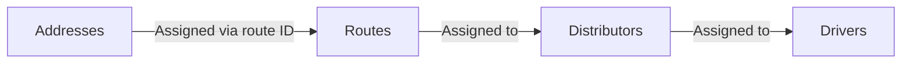

# Menighetsbladet Distribution Control Panel

Local data management system and interactive web dashboard for planning, maintaining, and executing distribution of parish magazines (*menighetsblad*). It synchronizes addresses, distributors (*bladbærere*), drivers (*kjørere*), and route assignments while calculating exact magazine order totals and generating print-ready delivery sheets.

---

## Repository Layout

- `data/`: Canonical source data and operational files:
  - `source.json`: The active, canonical single source of truth for addresses, distributors, drivers, and routes.
  - `source.backup-*.json`: Automatic timestamped backups generated on save.
  - `source.xml`: Snapshot and legacy XML export.
- `web/`: Modern static browser dashboard:
  - `index.html`: Web application shell, modals, and templates.
  - `styles.css`: Visual styling, print rules, and responsive design.
  - `src/`: Modular ES6 JavaScript source code:
    - `main.js`: Initialization, application lifecycle, autosave, file loading, and persistence.
    - `calculations.js`: Mathematical formulas, route normalization, metrics computation, and data linkage.
    - `tables.js`: Table rendering, multi-field filtering, sorting, pagination, and batch actions.
    - `modals.js`: Dialog handling for record creation, editing, batch updates, route merging, and deletions.
    - `map.js`: Leaflet & MarkerCluster interactive map, Geonorge address geocoding, and spatial route assignments.
    - `reports.js`: HTML generation for driver run sheets (*kjørelister*) and route distribution reports (*gatelister*).
    - `state.js`: Central state containers, filter criteria, and configuration definitions.
    - `i18n.js`: Multilingual translations (Bokmål, Nynorsk, English, Swedish).
    - `dom.js` & `utils.js`: DOM helpers, sanitization, and number parsing.
  - `dist/app.bundle.js`: Pre-bundled distribution script built using `esbuild`.
- `standalonePS/`: Zero-dependency, portable distribution package:
  - `START.bat`: One-click Windows launcher that starts the local HTTP server and opens the browser.
  - `STOPP.bat`: Clean shutdown script for the background server.
  - `server.ps1`: Lightweight native PowerShell HTTP server with `/api/save` endpoint and auto-backup engine.
- `tests/`: Automated test suite (Playwright / Node.js) validating data integrity, filters, exports, and user guide modals.
- `misc/`: Maintenance and diagnostic scripts for address auditing and route verification.

---

## Core Data Model (`data/source.json`)

The system enforces a relational model centered on `routes`:



### 1. `addresses`
Represents physical delivery locations:
- `address` *(string)*: Street name and house number (e.g. `"Solveien 12"`).
- `route` *(string)*: Normalized route identifier (e.g. `"A 5-6"`).
- `postnr` *(string)*: Postal code (e.g. `"1152"`).
- `numberOfHouseholds` *(integer, min 1)*: Total households at this address.
- `numberOfExcludedHouseholds` *(integer, min 0)*: Households opting out of delivery (*"Nei takk til uadressert post"*).
- `note` *(string, optional)*: Specific delivery notes (e.g. `"Inngang B i bakgården"`).

*(Note: Legacy fields such as `status`, `street`, `houseNo`, `distributor`, and `driverName` are omitted or derived dynamically).*

### 2. `distributors` (*Bladbærere*)
Volunteers delivering magazines door-to-door within assigned routes:
- `name` *(string)*: Full name.
- `status` *(string)*: `"active"` or `"inactive"`.
- `driverNr` *(string)*: Associated driver number.
- `driverName` *(string)*: Associated driver name.
- `phone` / `email` / `address` / `postnr`: Contact information.
- `routes` *(array of strings)*: List of assigned route IDs (e.g. `["A 1", "A 2"]`).
- `extraPapers` *(integer)*: Extra copies reserved directly for this distributor.

### 3. `drivers` (*Kjørere*)
Drivers distributing magazine bundles to distributors or designated pickup points:
- `driverNr` *(string)*: Identifier (e.g. `"1"`, `"2"`).
- `name` / `driverName` *(string)*: Driver full name.
- `status` *(string)*: `"active"` or `"inactive"`.
- `phone` / `email` / `address` / `postnr`: Contact details.
- `routes` *(array of strings)*: Direct routes assigned to this driver.
- `extraPapers` *(integer)*: Extra copies requested for the driver.

### 4. `routes`
Geographical distribution sectors:
- `routeId` *(string)*: Canonical identifier (e.g. `"A 5-6"`, `"B 10"`).
- `distributor` *(string)*: Name of the assigned distributor.
- `status` *(string)*: `"active"` or `"inactive"`.
- `requiresDistributor` *(boolean)*: `true` if route needs a local distributor; `false` if delivered directly by the driver.
- `extraPapers` *(integer)*: Extra buffer magazines for this specific route.
- `notes` *(string)*: Special logistics instructions.

---

## Core Calculation Rules

All views, exports, and dashboards strictly adhere to the following formulas:

$$\text{Included Households} = \max(0, \text{numberOfHouseholds} - \text{numberOfExcludedHouseholds})$$

$$\text{Magazines to Order} = \sum \text{Included Households} + \sum \text{Extra Papers}$$

### Route Normalization
All route references are canonicalized using `normalizeRouteIdentifier`:
- Whitespace is trimmed and multiple spaces collapsed.
- Suffixes and parenthetical numbers are preserved.
- Standard spacing is enforced between prefix letter and numbers (e.g., `A 1`, `B 3-6`, `K 1-2-4 til K9`).

---

## Execution & Hosting Modes

### 1. Portable Standalone Mode (Recommended for Windows Users)
Requires no prerequisites, installations, Node.js, or admin privileges:
1. Navigate to the `standalonePS/` directory.
2. Double-click `START.bat`.
3. The PowerShell HTTP server starts automatically and launches `http://localhost:8080/web/` in your default browser.
4. When editing in this mode:
   - Clicking **Save Changes** sends a `POST` request to `/api/save`.
   - The server creates a timestamped backup (`data/source.backup-YYYYMMDD-HHmmss.json`) and updates `data/source.json` directly.
5. To stop the server, double-click `STOPP.bat` or press `Ctrl+C` in the console window.

### 2. Development Mode
For developers editing client-side code in `web/src/`:
```bash
# Install dependencies
npm install

# Build client bundle (web/dist/app.bundle.js)
npm run build

# Watch mode for automatic re-bundling during development
npm run watch
```
Run any local static web server from the project root:
```bash
# Example with Node http-server or Python
npx serve .
# or
python -m http.server 8000
```

### 3. Pure Offline Browser Mode
You can open `web/index.html` directly or host it on any static web host:
- The dashboard automatically loads `data/source.json` via relative fetch, or prompts you via the **Choose Data File** loader.
- Edits are saved locally in the browser's IndexedDB.
- Clicking **Save Changes** exports the updated `source.json` file as a download, which you place in your `data/` folder.

---

## Testing & Quality Assurance

The test suite in `tests/` verifies end-to-end functionality using Playwright:

```bash
# Verify user guide modal behavior
node tests/test_user_guide.js

# Test core requirements and table calculations
node tests/test_all_6_requirements.js

# Test excluded address filters
node tests/test_excluded_filters.js

# Test filtered CSV/XLSX exports
node tests/test_export_filtered.js
```

---

## User Documentation

For the complete end-user guide covering all tabs, buttons, calculations, interactive map operations, and step-by-step distribution workflows, see:
- [README_USER.md](README_USER.md) (English)
- [README_USER.nb.md](README_USER.nb.md) (Norsk Bokmål)
- [README_USER.nn.md](README_USER.nn.md) (Norsk Nynorsk)
- [README_USER.sv.md](README_USER.sv.md) (Svenska)
